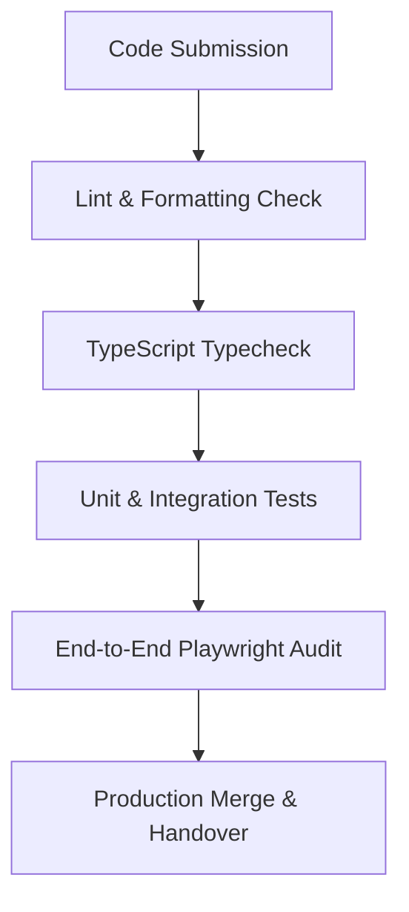

# Case Study: Methodologies in Agile & Agentic Delivery (MAAD)
### Feature Delivery: Secure Multi-Tier Community Referral Ingestion Engine

---

## Phase 1: Deterministic Blueprinting
Before writing implementation code, we established a technical system contract defining data structures, validation constraints, and interface boundaries.

### Input Data Contract
All incoming payload parameters must adhere to the following schema constraints:
- **email (Required):** Validated against strict email formats, capped at 254 characters.
- **full_name (Optional):** String up to 100 characters; defaults to "Anonymous Prospect".
- **referral_source (Optional):** Identifying tag used to trigger community referral logic.
- **skool_tier (Optional):** Classification parameter constrained to a verified set of options: ['firm', 'individual', 'partner'].
- **fax_number (Optional):** Hidden honeypot field designed to intercept bot submissions.

### System Boundaries & Error Handling
- **Honeypot Early-Return:** Submissions containing data in the honeypot field are flagged as automated bot requests. The system returns a success status immediately without committing any data to the database, mitigating resource depletion.
- **Transactional Decoupling:** Database insertions into the primary lead table and secondary referral table are isolated. A failure to register referral attribution details is logged as a non-critical event, allowing the core lead submission to proceed without disruption.

---

## Phase 2: Automated Test-Driven Guardrails
With the system contract locked, we wrote a comprehensive test suite to define and enforce behavior before starting development. This ensures that the codebase maintains a test-driven posture, satisfying strict acceptance criteria before integration.

Our test suite validated the following cases:
1. **Malformed Input Isolation:** Rejected invalid email addresses and truncated excessively long project descriptions.
2. **Honeypot Bypass Verification:** Confirmed that bot-generated requests return an HTTP 200 immediately without hitting database tables.
3. **Database Write Independence:** Verified that a database failure in referral attribution does not block or fail the primary lead registration process.
4. **Data Coercion & Fallbacks:** Checked that invalid tier parameters are automatically sanitized and coerced to the default tier level ("firm") instead of throwing server exceptions.

---

## Phase 3: Distributed Multi-Agent Prototyping
To build out the validated architecture, development was split into two parallel, isolated execution contexts:

### 1. Isolated Secure Relational Layer
This layer handles database writes, data validation, and transactional routing. Executing in an isolated, private workspace context, it processes the validated request, writes to the primary table, performs the conditional referral write, and handles database error containment. This guarantees that secure credentials and database tables are never exposed to external web environments.

### 2. Public Network and Notification Layer
This layer handles public cors configurations, API entry points, and webhook delivery. It intercepts incoming client requests, manages preflight checks, and sends structured, non-PII alerts to notification services. By separating these public hooks from the database write functions, we insulated the internal database from external network vulnerabilities.

---

## Phase 4: Peer Engineering Review and Integration Gate
The final stage involved checking the codebase against our strict integration criteria to ensure production readiness.

Our integration validation routine executed the following gates successfully:

- **Secret Separation Audit:** Verified that all connection strings, secrets, and environment tokens are resolved dynamically at runtime, with zero hardcoded credentials committed to source control.
- **Edge Runtime Promise Validation:** Verified that all asynchronous operations are fully awaited to prevent execution freezes typical of serverless containers.
- **Clean Compilation & Styling:** Ran static typing checks and code formatting tools to ensure the codebase remains clean and warning-free.
- **Coverage Validation:** Executed tests to confirm that statement, branch, and function coverages exceed the required 80% thresholds, maintaining structural integrity across all delivery modules.

### Final Project Status

| Deliverable | Verification Tool | Outcome | Status |
| --- | --- | --- | --- |
| Community Referral Database Insertion | Static Analysis | Verified schema mapping | PASSED |
| Edge Function Input Validation | Vitest Unit Suite | 30/30 tests passing | PASSED |
| End-to-End Layout & Submission Flow | Playwright Tests | 6/6 desktop/mobile tests passing | PASSED |
| Linter & Formatting Standards | Biome Compiler | 0 errors | PASSED |

The community referral system has successfully cleared all integration gates and is fully deployed to the production environment, marking this feature complete.
